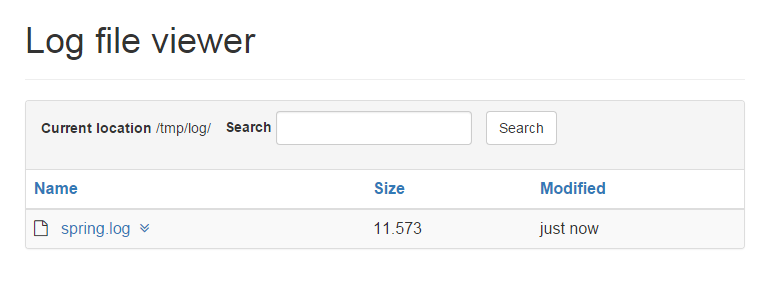

[](https://coveralls.io/r/lukashinsch/spring-boot-actuator-logview?branch=master)
[](https://travis-ci.org/lukashinsch/spring-boot-actuator-logview)
[](https://maven-badges.herokuapp.com/maven-central/eu.hinsch/spring-boot-actuator-logview/)

# spring-boot-actuator-logview
Simple logfile viewer as spring boot actuator endpoint

##Features
* allow quick access to spring-boot web application logfiles
* uses actuator framework to provide management endpoint
* list log folder content
* view individual logfiles
* view content of log archives (*.zip, *.tar.gz)
* browse subdirectories
* search in (non-compressed) files in logging root folder
* tail without reading entire file



##Howto use
* include library on classpath of spring-boot app
* configure `logging.path`, `logging.file` or `endpoints.logview.path` in spring environment
    * `logging.file` specifies a custom log file. Logviewer will use it's parent directory.
    * `logging.path` specifies a log directory and log filename `spring.log`.
    * `endpoints.logview.path` specifies a directory containing log files in case you use other custom log configurations.
* endpoint will be available under <management-base>/log
* to replace default stylesheet links, set property `endpoints.logview.stylesheets` in yml to list of urls

###Gradle
```groovy
compile 'eu.hinsch:spring-boot-actuator-logview:0.2.11'
```

###Maven
```xml
<dependency>
    <groupId>eu.hinsch</groupId>
    <artifactId>spring-boot-actuator-logview</artifactId>
    <version>0.2.11</version>
</dependency>
```


Note
* lib depends on spring-boot-starter-freemarker, so it may currently not work with another templating engine for the main app
